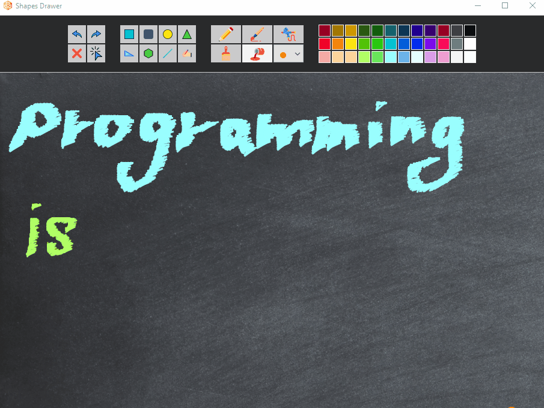
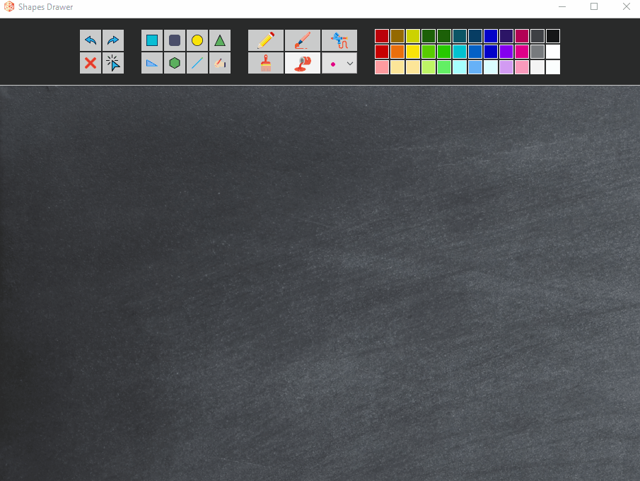

# Shapes Drawer
This is a mini project I did as a home assignment during a Java course. it's A fairly simple application, and I took Windows painter as a reference. I'm still working on this project though because it's really fun and I enjoy working with graphics.

#### Features
- Various shapes drawings in various colors.
- Filled color option.
- Supports the option to adjust a shape's size and color after creation.
- Free hand writing and drawing, using various tools selection.
- 5 line thickness options to select from.
- Supports undo, redo and clear canvas options.
- 
Icons made by <a href="https://www.flaticon.com/authors/freepik" title="Freepik">Freepik</a> from <a href="https://www.flaticon.com/" title="Flaticon">www.flaticon.com</a>

#### Demo

