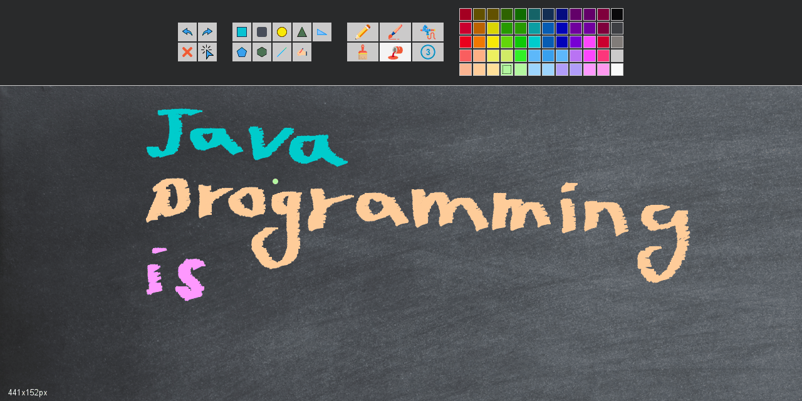

# Shapes Drawer
Started as a small home assignment project during a Java course in the university, which I kept working on and develop. I took Windows painter as a reference.  

Occasionally I will update some new or existing features.

#### Features
- Various shapes drawings in various colors.
- Filled color option.
- Supports the option to adjust a shape's size and color after creation.
- Free hand writing and drawing, using various tools selection.
- 9 line thickness options to select from.
- Supports undo, redo and clear canvas options.
- 3 backgrounds options.
- Drawing can be saved as a PNG file.
- 
Icons made by <a href="https://www.flaticon.com/authors/freepik" title="Freepik">Freepik</a> from <a href="https://www.flaticon.com/" title="Flaticon">www.flaticon.com</a>

#### Demo

