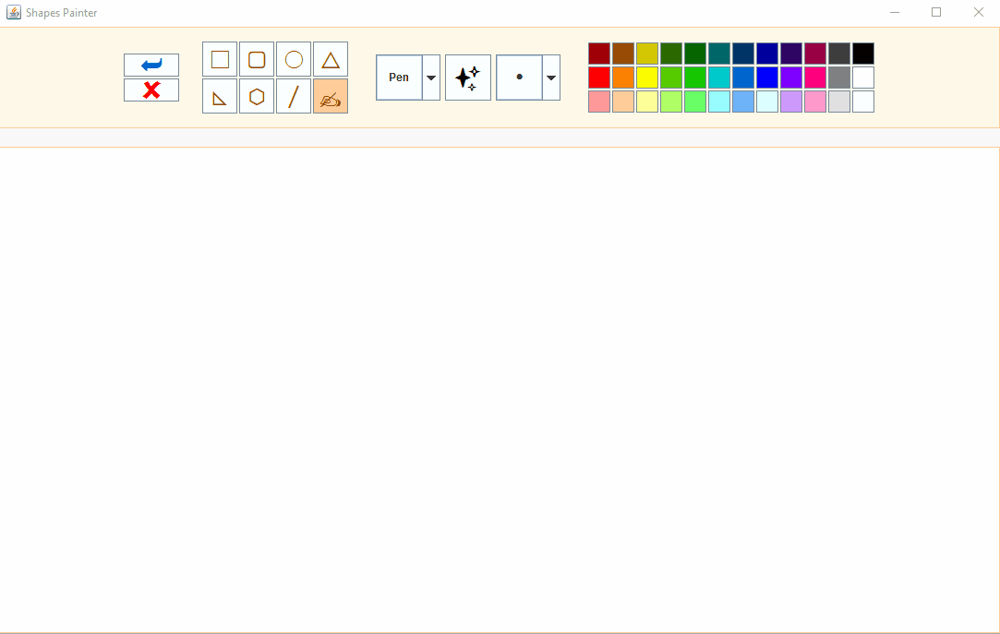

# Shapes Drawer
A fairly simple drawer, might resembles the Paint of Windows and it's not a coincedence. this is a mini project i did durring the latest course i'm taking in Java, while pursuing the B.Sc. degree. I searched for other applications to get inspiration from and Paint was right there...

#### Features
- Various shapes drawings in various colors, filled or no filled with color
- Free hand writing, using pen or brush selection
- 5 line thickness levels
- Supports undo and canvas clearing

#### Demo

